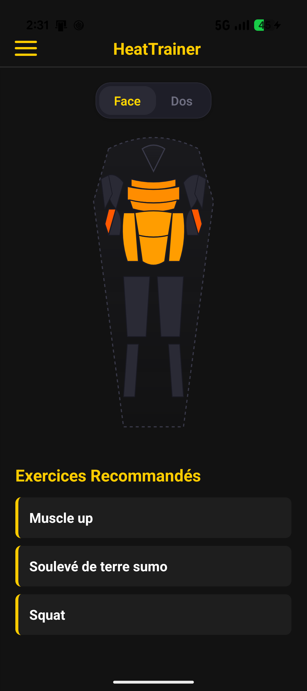
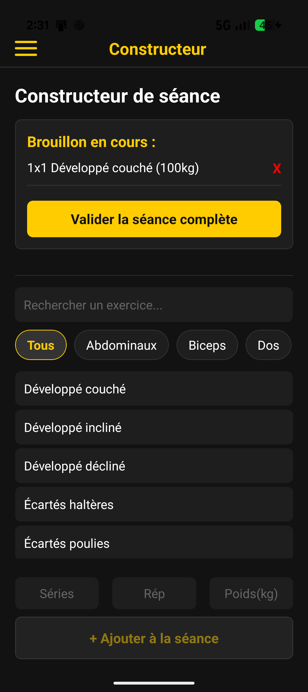

# HeatTrainer 🔥

HeatTrainer is a premium, full-stack fitness tracking application built with **React Native (Expo)** and **Node.js (Express & Prisma)**. It helps you log your workouts, visualize muscle fatigue with an interactive heatmap, and unlock gamified achievements.

## 🚀 Features

<p align="center">
  
  &nbsp;&nbsp;&nbsp;&nbsp;
  
</p>

- **Gamification & Achievements**: Unlock achievements like "Premier sang" (first workout), "Machine" (10 workouts), and "Titan" (10,000kg lifted). Notifications are localized based on your device language.
- **Dynamic Body Heatmap**: A visual 2D SVG heatmap of the human body (Front & Back) that updates based on the volume of exercises performed in the last 72 hours, using muscle activation coefficients.
- **Workout Builder**: Create and edit your workout sessions dynamically with an offline-first draft mode (`AsyncStorage`).
- **Full History**: View, edit, or delete past workouts.
- **Smart Recommendations**: Recommends exercises for "cold" muscles that haven't been worked out recently.

## 🛠 Tech Stack

- **Frontend**: React Native, Expo Router, TypeScript, React Native Svg, i18n-js.
- **Backend**: Node.js, Express, Prisma ORM, SQLite, JWT Authentication.
- **CI/CD**: GitHub Actions for automated type-checking and builds.

## 📦 Local Setup

### 1. Backend (Node.js API)
Navigate to the `backend` directory and set up the server:
```bash
cd backend
npm install

# Setup Prisma SQLite Database
npx prisma generate
npx prisma db push

# Seed the database with exercises
npm run seed

# Start the dev server (runs on http://localhost:3000)
npm run dev
```

### 2. Frontend (React Native Mobile App)
Open a new terminal, navigate to the `mobile` directory:
```bash
cd mobile
npm install

# Start the Expo bundler
npx expo start
```
Make sure to update `mobile/services/api.ts` with your computer's local IP address (`ipconfig` or `ifconfig`) so your physical phone can connect to the backend!

## 🧪 CI/CD
This repository is equipped with a GitHub Actions workflow that automatically verifies the TypeScript build for both the backend and the mobile app on every push or pull request to the `main` branch.

## 📜 License
This project is for educational and personal use.